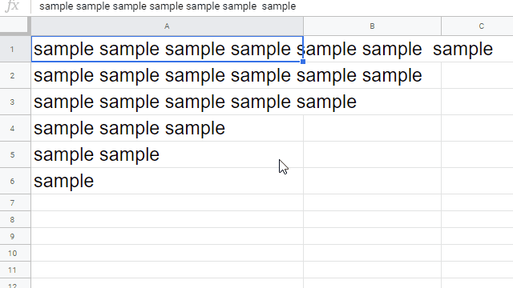
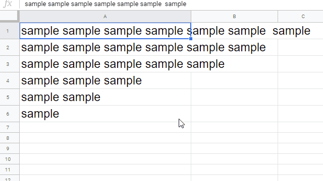

# RichTextApp

<a name="top"></a>
[](LICENCE)

<a name="overview"></a>

# Overview


**This is a GAS library for copying the rich text with the text styles from Google Document to Google Spreadsheet or from Google Spreadsheet to Google Document using Google Apps Script (GAS). And, also the rich texts in the cells can be converted to HTML format. Furthermore, the text length to fit in the cell width can be automatically adjusted.**

<a name="description"></a>

## Description

Google Spreadsheet can use the rich text as the cell value. But I thought that it is difficult for me to directly edit the rich text in a cell. So I wanted to copy the rich text, that I edited at the Google Document, to the cell of Google Spreadsheet. But, unfortunately, when the rich text in Google Document is manually copied to a cell in Google Spreadsheet, the text style is removed. By this, only text values are copied. It seemed that this was the current specification. So in order to achieve above, I created this as a library.

This library can do as follows.

1. Rich text in Google Document can be copied to the cell of Google Spreadsheet with keeping the text style.

2. Rich text in the cell of Google Spreadsheet can be copied to Google Document with keeping the text style.

3. Rich texts in the cells can be converted to HTML format.

4. Text length to fit in the cell width can be automatically adjusted by changing the font size.

## Available text styles

In the current stage, the rich text of Google Spreadsheet can use the following text styles. [Ref1](https://developers.google.com/apps-script/reference/spreadsheet/text-style-builder), [Ref2](https://developers.google.com/apps-script/reference/spreadsheet/text-style)

- Font family of the text
- Font size of the text in points
- Font color of the text
- bold
- italic
- strikethrough
- underlined

# Library's project key

```
1Ka6RcIG6G9P8AhkJtjy1DAnHk1_rShFPWtdCQ2bxwMsrRE8cfn0cDXBv
```

# Methods

| Methods                                                               | Description                                     |
| :-------------------------------------------------------------------- | :---------------------------------------------- |
| [DocumentToSpreadsheet(object)](#documenttospreadsheet)               | Copy rich text from Document to Spreadsheet     |
| [SpreadsheetToDocument(object)](#spreadsheettodocument)               | Copy rich text from Spreadsheet to Document     |
| [RichTextToHTMLForSpreadsheet(object)](#richtexttohtmlforspreadsheet) | Convert rich texts in the cells to HTML format. |
| [AutoResizeFontForSpreadsheet](#autoresizefontforspreadsheet)         | Adjust text length to fit in the cell width.    |

<a name="usage"></a>

# Usage:

## 1. Install library

In order to use this library, please install this library as follows.

1. Create a GAS project.

   - You can use this library for the GAS project of both the standalone type and the container-bound script type.

1. [Install this library](https://developers.google.com/apps-script/guides/libraries).

   - Library's project key is **`1Ka6RcIG6G9P8AhkJtjy1DAnHk1_rShFPWtdCQ2bxwMsrRE8cfn0cDXBv`**.

### IMPORTANT

**This library uses V8 runtime. So please enable V8 at the script editor.**

### About scopes

This library use the scope of `https://www.googleapis.com/auth/spreadsheets`.

But in the following sample script, `https://www.googleapis.com/auth/documents` is also used.

## Methods

<a name="documenttospreadsheet"></a>

### `DocumentToSpreadsheet`

In this method, the text in Google Document can be put to the cell of Google Spreadsheet with keeping the text style.

#### Sample script

```javascript
function DocumentToSpreadsheet() {
  // From
  var doc = DocumentApp.openById("###");

  // To
  var ss = SpreadsheetApp.openById("###");
  var sheet = ss.getSheets()[0];
  var range = sheet.getRange("A1");

  var res = RichTextApp.DocumentToSpreadsheet({ range: range, document: doc });
  console.log(res);
}
```

In this sample script, the text of Document is put to the cell "A1" of the 1st sheet in the Spreadsheet as the rich text.

<a name="spreadsheettodocument"></a>

### `SpreadsheetToDocument`

In this method, the text in the cell of Google Spreadsheet can be put to the Google Document with keeping the text style.

#### Sample script

```javascript
function SpreadsheetToDocument() {
  // From
  var ss = SpreadsheetApp.openById("###");
  var sheet = ss.getSheets()[0];
  var range = sheet.getRange("A1");

  // To
  var doc = DocumentApp.openById("###");

  var res = RichTextApp.SpreadsheetToDocument({ range: range, document: doc });
  console.log(res);
}
```

In this sample script, the text of the cell "A1" of the 1st sheet in the Spreadsheet is put to the Document with the text style with the append method.

<a name="richtexttohtmlforspreadsheet"></a>

### `RichTextToHTMLForSpreadsheet`

In this method, the rich texts in the cells on Google Spreadsheet are converted to the HTML format.

#### Sample script

```javascript
function RichTextToHTMLForSpreadsheet() {
  var ss = SpreadsheetApp.openById("###");
  var sheet = ss.getSheets()[0];
  var range = sheet.getRange("A1:A2");
  var res = RichTextApp.RichTextToHTMLForSpreadsheet({ range: range });
  console.log(res);
}
```

- When the value of cell on Spreadsheet in above demonstration image is converted to HTML format using this method, it can obtain this result. [https://jsfiddle.net/7e3mc10p/](https://jsfiddle.net/7e3mc10p/)
- When the range is only one cell, the string value of the HTML format is returned.
- When the range is the multiple cells, the 2 dimensional array including the HTML format is returned.
- This method was answered for [this thread](https://stackoverflow.com/q/62389397).

<a name="autoresizefontforspreadsheet"></a>

### `AutoResizeFontForSpreadsheet`

In this method, the text length to fit in the cell width can be automatically adjusted by changing the font size.

#### Sample script

```javascript
function AutoResizeFontForSpreadsheet() {
  const ss = SpreadsheetApp.openById("###");
  const sheet = ss.getSheetByName("Sheet1");
  const object = {
    range: sheet.getRange("A1:A6"),
    toLarge: true,
  };
  const res = RichTextApp.AutoResizeFontForSpreadsheet(object);
  console.log(res);
}
```

### Demo

In this demonstration, the lengths of texts in the cells "A1:A6" are matched to the cell width by changing the font size.



Above case, `toLarge` is `true`.



Above case, `toLarge` is `false`.

<a name="samples"></a>

## Sample script using this library

### 1. Convert HTML data to Rich Text on Google Spreadsheet

When this library is used, the HTML data in a cell on Google Spreadsheet can be converted to the rich text and put to the cell. The flow of this is as follows.

1. Retrieve HTML from a cell.
2. Create Google Document by converting HTML to Google Document as a temporal file.
   - In this case, Drive API is used.
3. Put the value to a cell as the rich text using the method of "[DocumentToSpreadsheet](#documenttospreadsheet)".
4. Remove the temporal file.

In this sample script, it supposes that the HTML data is put to a cell "A1" of the 1st tab on Google Spreadsheet, and the converted rich text is put to the cell "A2".

#### Sample script

In this sample script, Drive API of Advanced Google services is used. So before you use this, please enable Drive API at Advanced Google services.

```javascript
function convertHTMLToRichText() {
  var ss = SpreadsheetApp.openById("###"); // Please set the Spreadsheet ID.
  var sheet = ss.getSheets()[0];

  // 1. Retrieve HTML from a cell.
  var html = sheet.getRange("A1").getValue();

  // 2. Create Google Document by converting HTML to Google Document as a temporal file.
  var blob = Utilities.newBlob(html, MimeType.HTML, "sample.html");
  var tempDocId = Drive.Files.insert(
    { title: "temp", mimeType: MimeType.GOOGLE_DOCS },
    blob
  ).id;

  // 3. Put the value to a cell as the rich text using the method of "DocumentToSpreadsheet".
  var res = RichTextApp.DocumentToSpreadsheet({
    range: sheet.getRange("A2"),
    document: DocumentApp.openById(tempDocId),
  });
  console.log(res);

  // 4. Remove the temporal file.
  DriveApp.getFileById(tempDocId).setTrashed(true);
}
```

- As an important point, when the HTML data is converted to Google Document, there is the case that the font family is changed. I think that this might be the current specification of Drive API. So please be careful this.

## Limitations

As the limitation, in the current stage, the table, list and images cannot be used with the rich text of Google Spreadsheet. So please use only the texts with the text style.

---

<a name="licence"></a>

# Licence

[MIT](LICENCE)

<a name="author"></a>

# Author

[Tanaike](https://tanaikech.github.io/about/)

If you have any questions and commissions for me, feel free to tell me.

<a name="updatehistory"></a>

# Update History

- v1.0.0 (February 19, 2020)

  1. Initial release.

- v1.1.0 (June 16, 2020)

  1. Add new method of `RichTextToHTMLForSpreadsheet`. The method of `RichTextToHTMLForSpreadsheet` can convert the rich texts in the cells to the HTML format.

- v1.1.1 (June 16, 2020)

  1. About the method of `RichTextToHTMLForSpreadsheet`, I forgot to convert hyperlinks to HTML. This was modified.

- v1.1.2 (June 16, 2020)

  1. When one row and several columns are used as the range, only 1st column is returned. This bug was removed.

- v1.1.3 (June 17, 2020)

  1. The variable name for the error processing was not correct. The bug was removed.
  1. Added [a sample script](#samples) for using this library.

- v1.2.0 (July 3, 2020)

  1. Added the method of [`AutoResizeFontForSpreadsheet`](#autoresizefontforspreadsheet). This method can automatically adjust the text length to fit in the cell width by changing the font size.

[TOP](#top)
